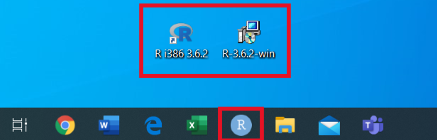
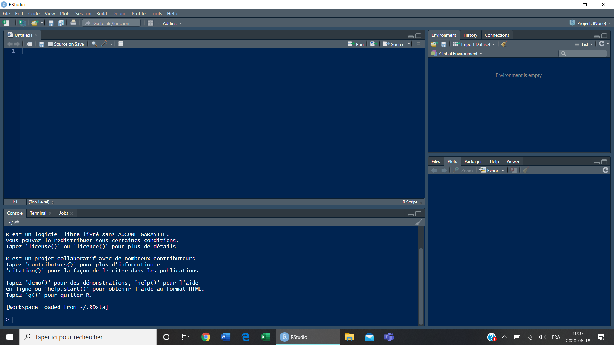
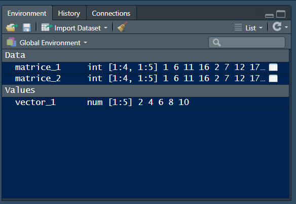
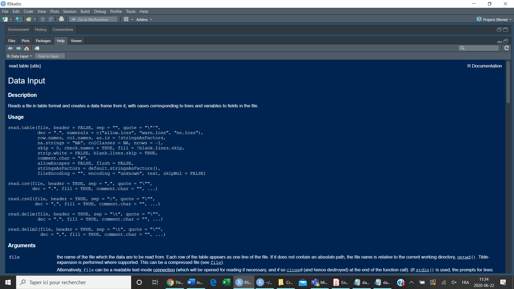
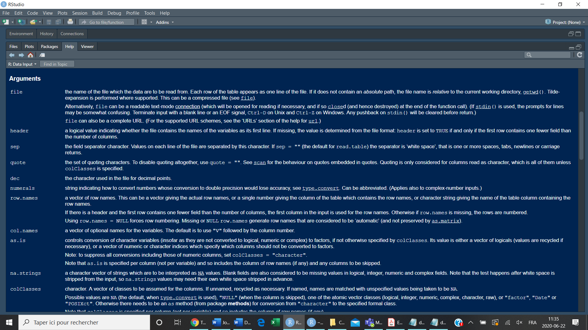

# Introduction to RStudio {.tabset .tabset-fade}

## Set Your Work Space

### Install R and RStudio  

#### R

* To install R, go to https://cran.r-project.org/ 

* Choose the version according to your computer's operating system.

* For more details, go to https://rstudio-education.github.io/hopr/starting.html


#### R Studio

* To install RStudio, go to https://rstudio.com/products/rstudio/download/

* Choose the **Free** version and click on **DOWNLOAD**

### Open RStudio

On your desktop, the RStudio icon will look like the bottom one:




When you open RStudio, the layout will look as follow:



It is devided into 4 panes:

#### 1. Script (Top left)

This is where you will write your commands if you want to save them as a script. You can move wherever you want in the script, skip lines and earase.

#### 2. Console (Bottom left) 

You can also write any command here but they will **not be saved** in your script. You can neither earase or go back. The console is mostly used to see the *output* of the command you write in the script. For instance, if you write `1+4` in the script, you will see a `5` appear in the console.

To **RUN YOUR COMMAND**, click on the `Run` button at the top right of your script or press `Ctrl+Enter` (Windows) `Cmd+Enter` (Mac)


```{css, echo=FALSE}
.lightblue {
  background-color: lightblue;
}
```
```{css, echo=FALSE}
.lightcyan {
  background-color: lightcyan;
}
```


```{r class.source="lightblue", class.output="lightcyan"}
1+4
```

#### 3. Environment (Top right)

This is where the objects (vectors, data frame, matrices) you create will be saved.

#### 4. Files,Plots,Packages... (Bottom right)

You can use it to naviguate through your files and to visualize the plots/figures you create. You can also use it to install packages (one of the ways to do it) and it is where the information will appear when you **seek for help**.

#### Layout
You can change the layout in `View > Panes > Pane layout...`

You can also change the front type, color and size by going in `View > Panes > Pane layout... > Appearance`


### Working Directory

#### Get Working Directory

This command allows you to see where RStudio gets the documents you want to open

```{r get_working_directory, class.source="bg-success", class.output="bg-success"}
getwd()
```

In my personal computer, R will go get the document inside the file called *Creating a tutorial*, which is inside a file called *R*, inside another file called *Été 2020*, etc. The Working Directory on your personal computer will therefore be different. 

When you want to open a document (data table, script...) **it has to be in your working directory**. 

#### Set Working Directory

The working directory can be changed through many different ways. One easy way to do it is to go in `Session > Set Working Directory > Choose Directory...` Once in the desired file, click on `Open`

You can also go into `Files` in the `Files,Plots,Packages...` (bottom right). Once in the desired file, `More > Set As Working Directory`

Both methods correspond to writing the command (which in red is the path to your documents inside your computer) :

```{r set_working_directory}
setwd("~/tutorial-sophie/")
```


## Getting Started With Simple Commands

#### Calculations

Try writing these calculations in your `script` and verify the output in the `Console`:

```{r calculation_1}
10*5
```

```{r calculation_2}
100/5
```


To make an exponent, you can use `**` or `^`
```{r calculation_3}
2**2
```
```{r calculation_4}
2^2
```

#### Symbols

* A `#` is used to write notes in your script. Any lines starting with `#` will not be read by R and will only appear as comments.

* The equal sign `=` as well as the `<-` can be used to assign objects (see later). You can use either one but try to be consistent.

* The double-equal sign `==` is used to make comparison, as well as the does not equal sign `!=` 

```{r }
2==4
```

```{r }
2!=4
```

* You might also want to know is something is bigger or equal `>=` or less or equal `<=` to something else

```{r }
2>=4
```

* `&` means *and*

* `|` means *or*

## Data Types


### Numerical

To see the data type you are dealing with, use the `class` function. Here, `a` is an object made of one numerical value (`5`).

```{r }
a<-5
class(a)
```

### Character

Objects can also be filled with `character` by using quotation marks.

```{r }
b<-"hello"
class(b)
```

Watch out! If you use quotation marks around numbers, they will be considered as `character`

```{r }
c<-"6"
class(c)
```


### Logical

The only two logical values are `TRUE` and `FALSE` which can also be written as `T` and `F`

```{r }
2==4
class(2==4)
```

### Change data type

It is possible to switch from one data type to another by using the different `as.` functions. `d` is a vector made of numerical values. By using `as.logical` the `1` are by default considered as `TRUE` and the `0` as `FALSE`.

```{r }
d<-c(1,0,0,1,1,0)
class(d)
as.logical(d)
```


## Objects

In R, datas are stored in what we call `Objects`. Once you create an object, you will find it in the `Environment`.

### Vectors

A `Vector` is a serie of data of the **same** `Data Type`. To create a vector called `vector_1`, use the `c()` function to **combine** the elements `2,4,6,8,10`.


```{r vector_1}
vector_1<-c(2,4,6,8,10)
```
#### Manipulate Vectors

You can add/substract vectors of the same length, multiply vectors, etc. You can also isolate/extract the datas present at certain positions in a vectors.

If you want to get the third element of `vector_1`, which is `6` you can use the square brackets `[]`. This is what we call **Indexation**

```{r vector_1_third_element}
vector_1[3]
```
It is also possible to get multiple elements (for instance from the third to fifth element)
```{r vector_1_third_to_fifth_element}
vector_1[3:5]
```

### Matrices

To create a matrice called `matrice_1`, use the `matrix` function. Indicate the datas you want to include and the number of rows and columns. 

```{r matrice_1}
matrice_1<-matrix(1:20, nrow=4, ncol=5)
```
```{r view_matrice_1}
show(matrice_1)
```

By default, the matrice was filled by column. See what happens if you add `byrow=TRUE` as an argument.

```{r matrice_2}
matrice_2<-matrix(1:20, nrow=4, ncol=5, byrow=TRUE)
```
```{r view_matrice_2}
show(matrice_2)
```
The matrice is now filled by row.

#### Manipulate Matrices

You can also use **indexation** to isolate datas in matrices. The first element inside the `[]` indicates the row number, whereas the second element indicates the column number. If you want to isolate a particular row or column, juste leave the other element empty.

```{r }
matrice_2[2,3]
```
```{r }
matrice_2[,3]
```
In your environment, you should now have 3 `Objects`.




### Data Frame

A data frame is like a matrix in which each column can be filled with different data types. Let's create one `numeric` and one `character` vector. The function `data.frame()` can then be used to bind those two vectors together into a data frame.

```{r }
V1<-c(1,2,3,4)
V2<-c("one","two","three","four")

data_frame_1<-data.frame(V1,V2)

show(data_frame_1)
```

You can also name the columns of your data frame

```{r }
names(data_frame_1)<-c("numeric","character")
show(data_frame_1)
```

### List

A list is like a vector in which you can put different data types

```{r }
L1<-list(4,"blue", TRUE)
L1
```


## Open Files

Download the following documents and save them in a file of your choice.

```{r, echo=FALSE}
xfun::embed_file('datas_example.csv')
```

* This file is a `.csv` document. I recommend that you first open it in Excel to visualize it.

```{r, echo=FALSE}
xfun::embed_file('datas_example.txt')
```

* This file contains the same datas but is in the `.txt` format.


To open a document/file in RStudio, set the appropriate Working Directory (as seen in Set Your Workspace). Again, your code between the parentheses will be different because it refers to the workspace in **your** computer.

```{r set_wd}
setwd("~/tutorial-sophie/")
```


### read.table()

If you want to open a `.txt` document (in which datas are seperated by a space), the easiest way is to use `read.table`. In this example, `datas_example.txt` is stored in an object called `datas_txt`

```{r open_txt}
datas_txt<-read.table("datas_example.txt", dec=",", header=TRUE, row.names = 1)
```

The arguments after the file name depend on how the the datas are structured. For instance,`header=TRUE` indicates that the datas in the first row are the columns names and `row.names=1` indicates that the datas in the first column are the row names (individuals 1 to 10). Finally, `dec=","` means that a comma indicates the position of the decimals.

```{r show_txt}
show(datas_txt)
```


### read.csv()

Datas in the format `.csv` are seperated by a `,` or a `;` and can be opened with `read.csv` or `read.table` depending on the arguments you add.

```{r open_csv}
datas_csv<-read.csv("datas_example.csv")
```

If you open the file like this, you will only see one column with all the datas seperated with a `;`. Must must then add the argument `sep=";"` and again `row.names=1` to make the first column the samples number (individuals 1 to 10). When you use `read.csv`, `header=TRUE` is set by default so you do not have to write it. However, if you happen not to have a header you would have to put `header=FALSE`.

```{r open_csv2}
datas_csv<-read.csv("datas_example.csv", sep=";", dec=",", row.names = 1)
```

You can also use `read.table` to read a `.csv` but you need to add `header=TRUE`

```{r }
datas_csv_2<-read.table("datas_example.csv", sep=";", dec=",", row.names = 1, header=T)
```


#### Reach for help

You do not have to remember all the argument you need to write !

For any function, you can always *reach for help* by writing a `?` in front of the function. To know all the possible arguments for the `read.table()` function, simply write:

```{r help}
?read.table()
```

In the `Files, Plots, Packages, Help...` you will see the `Help` section open. You will find a lot of information about the default arguments of `read.table()`and also `read.csv()`. For instance, the default `sep` of `read.table()` is a space. If you go down to the arguments section, you can read that `sep` mean *the field seperator character*.





### readHTMLTable()

If you only have an HTML link to you data table, you can also open it using `readHTMLTable`. *Reach for help* to read about the possible arguments,the first one being the URL.

```{r }
??readHTMLTable
```


## Manipulate Your Datas

Let's explore `datas_txt` (which is the same as `datas_csv`). This fictional data frame tells us the size, the sex and the age of 10 individuals. The datas in the last column also tell us whether or not this person likes plants.

The function `summary` can be usefull to visualize basic informations about your datas

```{r summary}
summary(datas_txt)
```

and the function `dim` can help to verify that the data frame has the good dimensions

```{r dim}
dim(datas_txt)
```

10 rows and 4 columns

In the `likes_plants` column, it is not appropriate to say that the mean or a minimum value exist. In fact, as seen in the section *Data Types* section, `1` and `0` can be used to represent logical values. (1 = YES I like plants / 0 = NO I do not like plants). For a better visual representation, it can be useful to transform this column into `TRUE/FALSE`


```{r }
datas_txt$likes_plants<-as.logical(datas_txt$likes_plants)
show(datas_txt)
```

The `$` is used to extract the datas of one variable

```{r size}
datas_txt$size
```

Let's say I want to create a new object that contains the datas for the female indivuduals only. I use the `$` to select a particular variable within the data frame. I use the `==` to specify that I want the datas for which the variable `sex` is equal to `F`. Everything is between `[]`to tell that the new set of datas is extracted from the original `datas_txt`. **Don't forget the `,` before closing the square bracket**

```{r female}
female<-datas_txt[datas_txt$sex=="F",]
show(female)
```


Let's say I want to count how many people like plants. The datas can be isolated in the same manner as for the females. The function `nrow` is then used to calculate how many rows (how many individuals) there are in the new set of datas. The result is `8` which correspond to the number of `1` in the last column of the original `datas_txt`


```{r }
nrow(datas_txt[datas_txt$likes_plants==T,])
```


```{r setup, include=FALSE}
knitr::opts_chunk$set(echo = TRUE)
```

## R Markdown

This is an R Markdown document. Markdown is a simple formatting syntax for authoring HTML, PDF, and MS Word documents. For more details on using R Markdown see <http://rmarkdown.rstudio.com>.

When you click the **Knit** button a document will be generated that includes both content as well as the output of any embedded R code chunks within the document. You can embed an R code chunk like this:

```{r cars}
summary(cars)
```

## Including Plots

You can also embed plots, for example:

```{r pressure, echo=FALSE}
plot(pressure)
```

Note that the `echo = FALSE` parameter was added to the code chunk to prevent printing of the R code that generated the plot.
